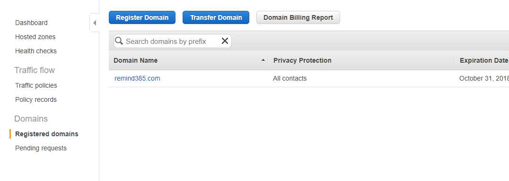
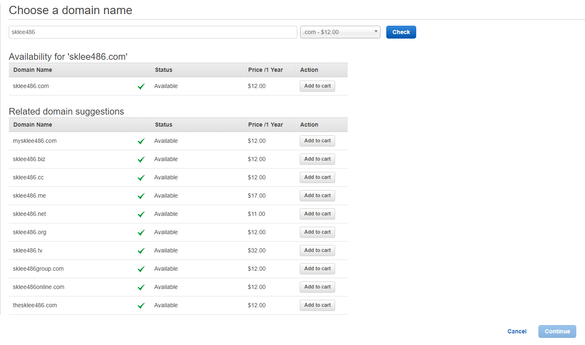
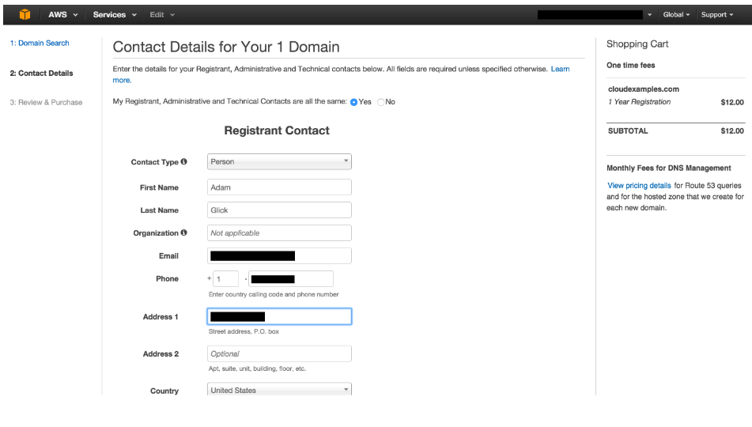

## 도메인 생성
- 기본적으로 EC2는 유동 IP 이다
- 선행 작업으로 인스턴스를 고정 아이피로 변경 해야 한다
    - [고정아이피 변경](Elasticip.html)
    - 고정아이피로 해놓고 사용을 안하면 요금이 부과된다.
- https://aws.amazon.com/ko/getting-started/tutorials/get-a-domain/ 참조 

### 도메인 구입
1. route53 대시보드로 이동
2. 좌측 메뉴의 Registered domains 클릭 후   
    Register Domain 클릭  
        

3. 원하는 도메인을 입력후 check 를 눌러 구입 할 수 있는지 검색 후  
    원하는 도메인을 Add to cart를 누르고 페이지 하단 Continue 클릭
        
4. 담당자 세부 정보 입력 후 하단 Continue 클릭     
    
5. 세부 정보 확인 후 Complete Purchase 클릭
6. 이메일을 확인 하는 절차가 있을 수 있는데 이메일 확인 후 링크 이동 후 확인누르면 완료 

### 도메인 연결

