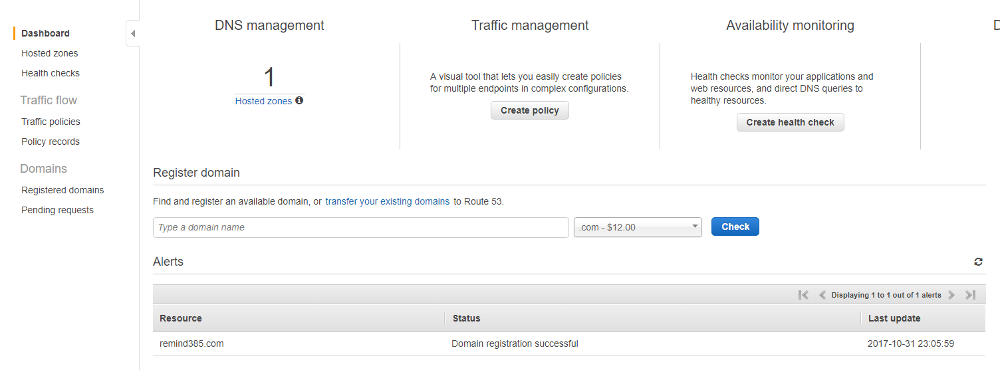
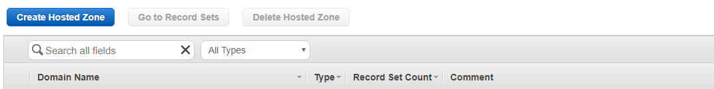

## 도메인 연결
- 기본적으로 EC2는 유동 IP 이다
- 선행 작업으로 인스턴스를 고정 아이피로 변경 해야 한다
    - [고정아이피 변경](Elasticip.html)
    - 고정아이피로 해놓고 사용을 안하면 요금이 부과된다.
- https://aws.amazon.com/ko/getting-started/tutorials/get-a-domain/ 참조 

1. Router53 대시보드로 이동    
    
2. Hosted zones 선택
        
3. Create Hosted Zone 클릭
