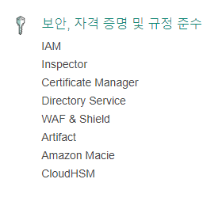
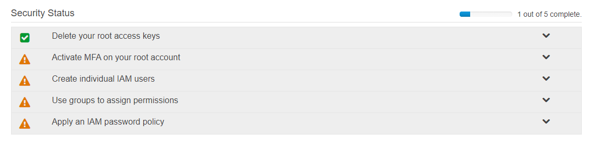
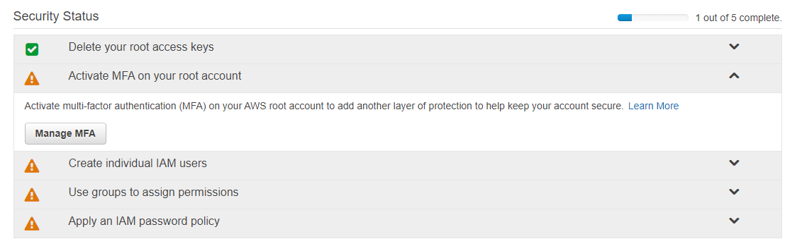
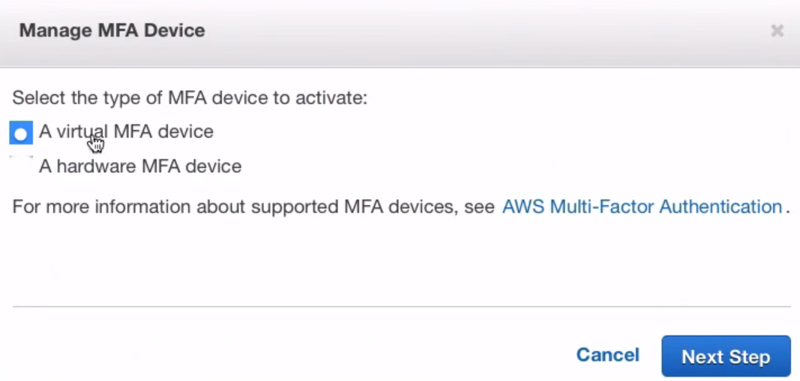
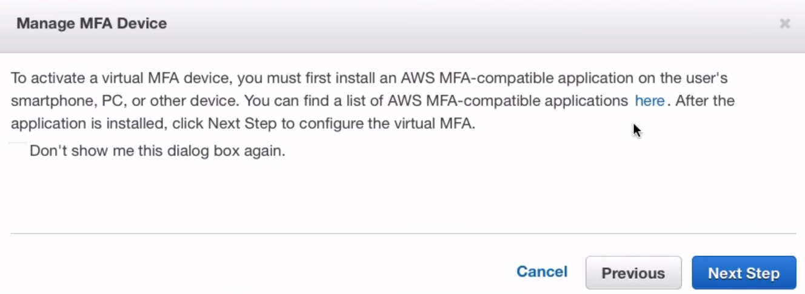
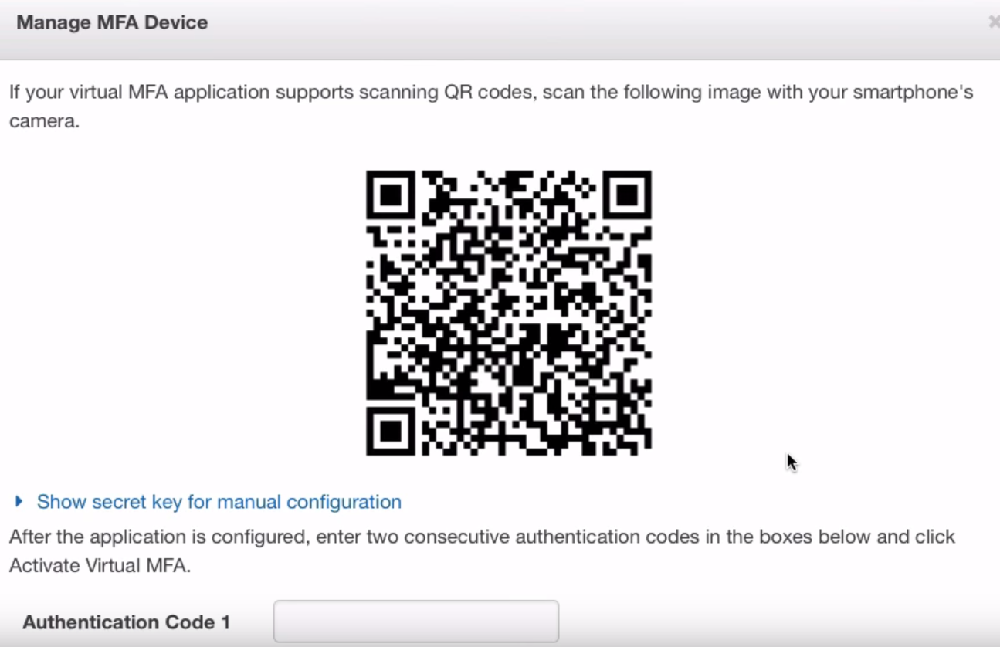
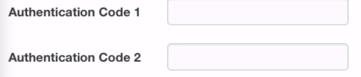
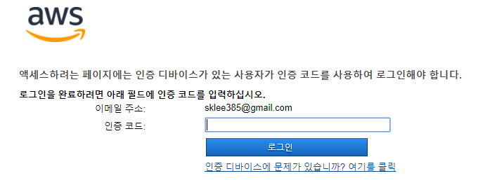
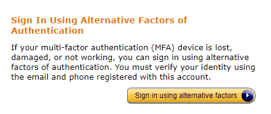
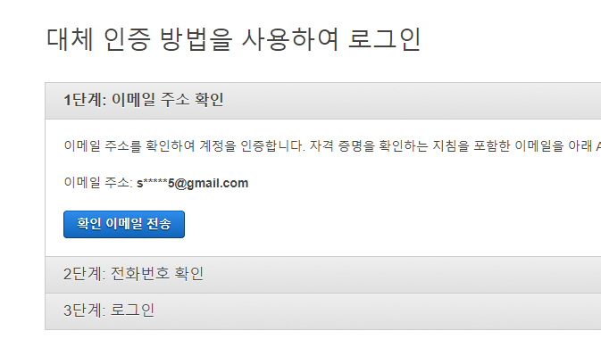

## 보안 설정 - 2단계 인증
1. 아마존 콘솔로 이동
2.  에서 서비스 클릭
3.  에서 IAM 클릭
4.      
    이 화면이 현재 내 보안 상태
5.  
    manage MFA 클릭
6.  
    처음 것 선택 후 next step
7.  
    저기서 here 를 누르면 지원하는 otp 종류가 나오지만    
    구글 otp 쓰는걸 추천
8.      
    구글 오티피를 설치해서 추가 버튼을 누르고     
    바코드 스캔을 선택 후 저 바코드를 찍으 확인 누름
9.      
    저 항목은 오티피 나오는 것을 적고 시간이 지나 새로 고침 되면 
    다시 적어 주면 된다.
10. 이제 로그아웃 후 로그인 하면서 정상적으로 되는지 확인
    
--- 
## 휴대폰 분실의 경우
1.  
    에서 인증 디바이스에 문제가 있습니다. 클릭
2.  
    sign in using altemative factors 클릭
3.  
    이메일과 전화번호로 인증해서 로그인 

