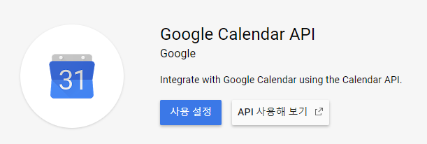

## 구글 API 인증 
- [구글 클라우드 콘솔](https://console.developers.google.com/apis?project=api-project-549483232332)
- [OAuth](https://oauth.net/2/)

- 구글 서버에게 승인을 받아 id, 시크릿 키를 받아야 한다   
    1. [https://console.cloud.google.com](https://console.cloud.google.com)
                
    2. 이런 화면이 나오는데 여기서 API Project 버튼을 누른다
            
    3. 이러한 화면이 나오면 + 버튼을 누른다   
            
    4. 프로젝트 명을 넣고 만들기 버튼을 누른다
        
    5. 상단 화면을 보면 알림쪽에 뺑글뺑글 도는걸 확인 할 수 있는데 좀 기달리면 완료 된다. 
        
    6.   버튼을 클릭하여 내가 만든 API 를 선택하면  
        해당 API 의 대시보드로 이동
    7. 좌측 메뉴에서 API 및 서비스 > 대시보드 클릭  
        
    8. 다음 화면이 나오면 좌측 메뉴의 사용자 인증 클릭  
        
    9. 사인자 인증 정보 만들기 > OAuth 클라이언트 ID 클릭
        
    10. 동의 화면 구성 클릭
        
    11. 정보 입력후 저장
        
    12. 애플리케이션 유형 선택 > 생성    
                
    13. 이런 화면이 나오면서 클라이언트 ID와 보안키가 생성 된다
            
        (이미지 : 생활코딩 동영상 추출)
    14. 클라이언 ID 파일을 다운 받아서 관리하면 된다. 

---

- 사용할 서비스를 선택

    1. 좌측 메뉴의 라이브러리 선택 
        
    2. 다음과 같은 화면이 나온다   
        
    3. 사용할 서비스를 검색해서 찾으면 된다.    
        예를 들어 Calender를 사용한다고 하면 
            
        검색하게 되면 다음 화면이 나오게 된다.  
        Google Calender API 선택  
            
        이 나오는데 사용 설정을 누르면 된다. 
    4. 