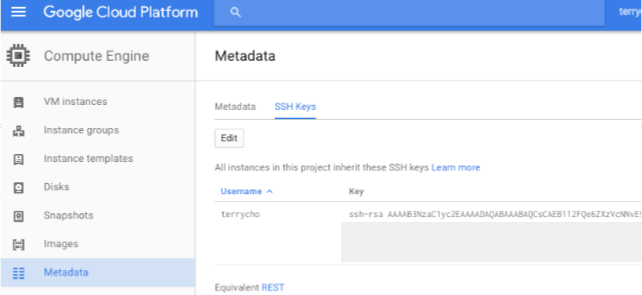
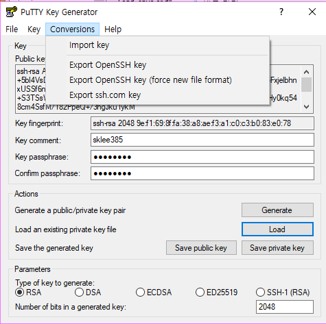
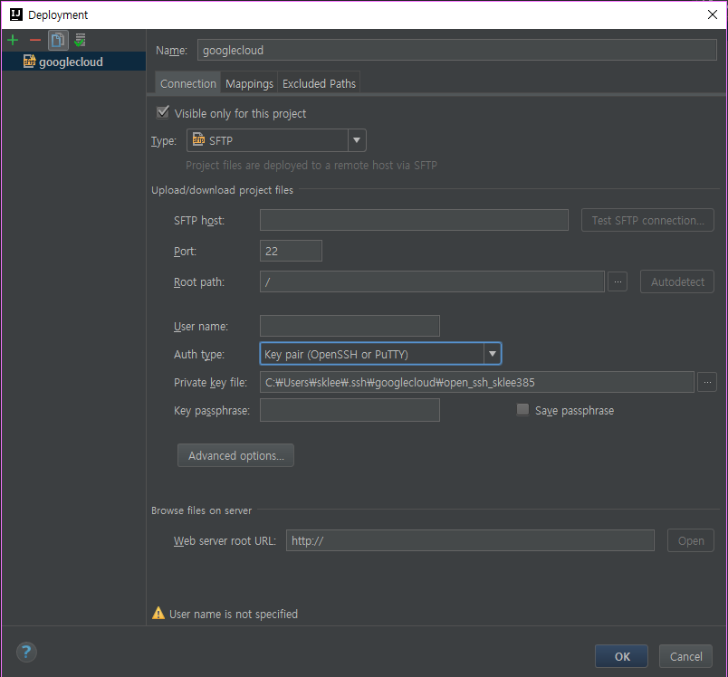

## ssh 접속 
- 구글 클라우드는 일반적으로 id / passwd 로 로그인이 안되고 키를 등록 시켜서 
   그것으로 로그인 하는 방식으로 진행해야 한다. 
   
1. server client 
    1. 공개키 접속 
        - [http://bcho.tistory.com/1103](http://bcho.tistory.com/1103)
        1. git-bash 에서 다음 명령어를 친다. 
            ```$xslt
            ssh-keygen -t rsa -C "구글계정명"
            ```
            명령어를 치면 name 과 password 를 지정하게 된다 .    
            완료가 되면 파일이 
                - 지정한이름
                - 지정한이름.pub
            파일이 생성되게 된다. 
        2. 다음 명령어를 친다.
            ```$xslt
            cat ~/.ssh/지정한이름.pub
            ```
            이때 나온 값을 구글 클라우드 다음 메뉴에 넣는다.    
            "Compute Engine > Metadata > SSH Keys"
            
        3. 키 등록이 끝났다 이제 접속만 하면 끝    
            ```
            ssh -i ~/.ssh/지정한이름 구글계정명@아이피
            ```
    2. putty 등록후 접속 
        - [http://stove99.tistory.com/172](http://stove99.tistory.com/172)
        
    3. intelliJ remote 사용 
        - 인텔리 J 같은 경우는 open ssh 키를 사용한다. 
        - 2번에서 만든 ppk 파일을 이용해서 puttygen 을 이용하면 쉽다. 
        1. puttygen 에서 load 버튼을 눌러서 *.ppk 파일을 불러온다.
        2. Conversions > Export Openssh key 를 눌러서 저장
        
        3. 인텔리J에서 Remote 에 들어갈려면  Tool>Deployment>Browse Remote Host 를 누른다. 
            shift+enter 를 눌러서 등록 화면에 들어간다 .
            
            입력 값을 채워 나가는데 이중 주의 할 점이    
            Auth type 값을 keypair(OpenSSH or PuTTY)      
            라고 되어 있는 값으로 해야 한다.     
            값에는 분명 putty 키도 된다고 하는데 안되다.....        
            prive key file 은 아까 생성한 open-ssh 키를 등록 시킨다. 
            SFTP host 나 User name 은 구글 클라우드 아이피 / 아이디를 입력
            key passsphrase는 puttygen에서 만들떄 사용한 비밀번호 
            
                